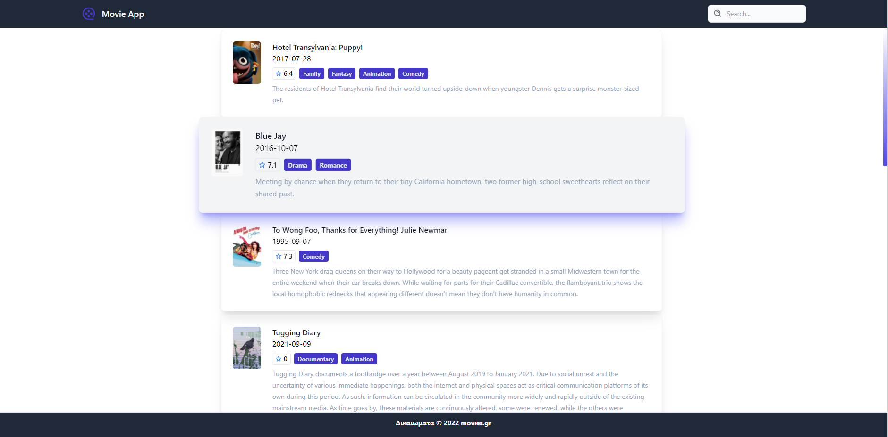
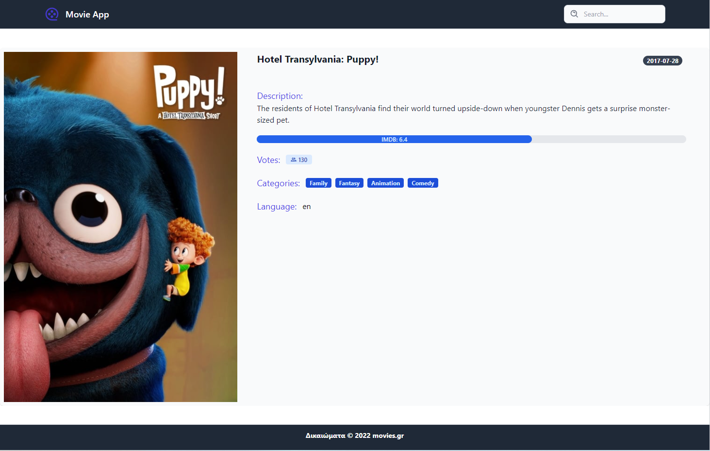

# REACT MOVIE APP

# Description

#### You can see demo at : https://iliophanis.github.io/movie-app/
#### This is an application using React as the framework and allows the user to search movies they want to watch from the MovieDB API.

# Installation

#### No installation, this application is to be used on the browser. If wanting to work on contents of the application, user will need to clone the repo and install dependencies.

# Usage

#### This application will allow users to search for movies and will be able to click on them to view their MovieDB page.

## Movies List Preview

## Movies Details

# License

#### This project is license under MIT

# Contributing

#### Contributors should read the installation section.

# Tests

#### No tests are used in this application.

# Questions

#### If you have any questions about this projects, please contact me directly at iliophanis@gmail.com. You can view more of my projects at https://github.com/iliophanis.
